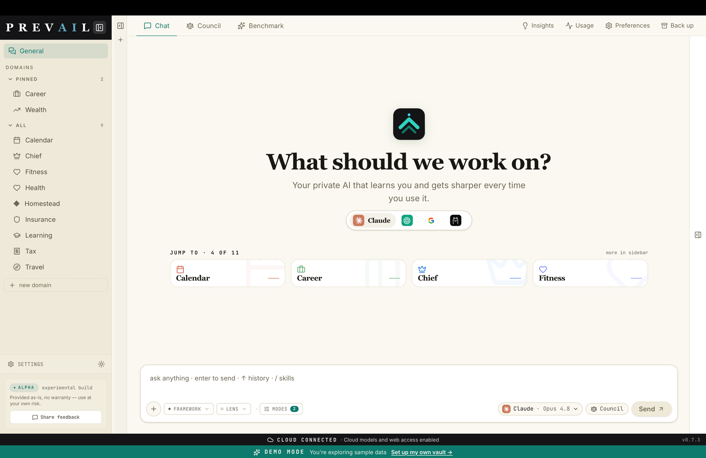
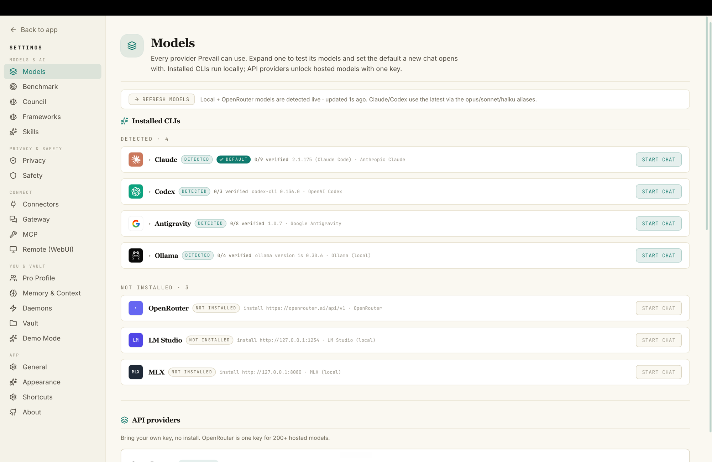

<div align="center">


# Prevail

**Your private AI that learns you and gets sharper every time you use it.**

A local-first **life-OS** for macOS — a native cockpit that runs AI per
life-domain (wealth, health, tax, career…), grounded in a local markdown vault.
No terminal required.

<p>
  <a href="https://github.com/fru-dev3/prevail-desktop/releases/latest/download/Prevail-mac-arm64.dmg"></a>
</p>

<p>
  <a href="https://github.com/fru-dev3/prevail-desktop/releases/latest"></a>
  
  
  
</p>

**[⤓ Download the latest `.dmg`](https://github.com/fru-dev3/prevail-desktop/releases/latest/download/Prevail-mac-arm64.dmg)** &nbsp;·&nbsp; [prevail.sh](https://prevail.sh) &nbsp;·&nbsp; [all releases](https://github.com/fru-dev3/prevail-desktop/releases)

<br />



</div>

> **Local-first.** Your vault, chats, and the durable *intent ledger* stay on
> your machine. Nothing leaves unless you turn on an integration. Tauri 2 +
> React 19 + Tailwind 4, with a bundled engine (the
> [Prevail CLI](https://github.com/fru-dev3/prevail-cli)) — same vault format.

## Screenshots

<div align="center">

| Domain-grounded chat | Every model, one cockpit |
| :---: | :---: |
|  |  |

</div>

## What it does (v0.7)

- **Demo-first.** Every launch starts in demo mode with a pre-populated Jordan Smith
  household vault (11 domains, realistic data and chat history). Explore freely, then
  switch to your own vault when you're ready — one click in Settings → Demo Mode.
- **Starter packs.** Import a ready-made domain set for your situation (Family, General,
  High-Income, Freelancer, Creator, Small Business Owner, Student). In demo mode,
  importing a pack walks you through vault setup first so nothing gets lost.
- **Domains** — each folder with `soul.md`/`state.md` becomes a life-domain; chat
  is grounded in that domain's real state and history.
- **Self-learning** — every chat is captured as an *intent* the moment you send
  (raw transcript, never lost), distilled into per-domain memory (`_memory.md`)
  that's fed back into future chats. See `docs/` for the model.
- **Any model** — installed CLIs (Claude / Codex / Antigravity / Ollama) **or**
  bring-your-own via the **OpenRouter** gateway (one key, 200+ models). Switch
  models per turn; context carries across.
- **Council** — fan one question to multiple models in parallel; a chair model
  synthesizes a verdict.
- **Memory & Context, Safety, Gateway (Telegram), MCP (consume + expose),
  Providers, Remote (WebUI)** — all in Settings.
- **Usage dashboard**, benchmark viewer, in-app **auto-update**, start-on-boot,
  tray, export/import config.
- **Remote (WebUI)** — serve the *same* UI to a browser (no duplicate UI);
  off by default, loopback-bound, allowlisted. Reach it via Tailscale.

## Requirements
- macOS 13+ (Apple Silicon).
- Optional: `claude` / `codex` / `agy` / `ollama` on `$PATH`, and/or an OpenRouter
  key (Settings → Providers). The bundled engine handles the rest.
- No setup needed — launch and explore the demo, then pick a folder for your own vault.

## Install
Download the signed, **notarized** `.dmg` from
[prevail.sh](https://prevail.sh) or the
[releases page](https://github.com/fru-dev3/prevail-desktop/releases) and drag
`Prevail.app` to `/Applications`. (Notarized — no Gatekeeper "damaged" warning.)

## Develop
```bash
npm install
npm run tauri dev     # hot-reload
npm run tauri build   # signed .dmg under src-tauri/target/release/bundle/dmg/
```
The engine **sidecar** is built from the sibling `fd-apps-prevail-cli` repo by
`scripts/prepare-sidecar.sh` (wired into `beforeBuildCommand`). See
[CONTRIBUTING.md](CONTRIBUTING.md).

## Architecture
- **Frontend:** Vite + React 19 + Tailwind 4. Talks to the backend only through
  `src/bridge.ts` (Tauri IPC on desktop, HTTP/SSE in the browser).
- **Backend (Rust):** Tauri 2 — engine seam (`engine.rs`), distillation daemon
  (`distill.rs`), Telegram bridge, WebUI bridge (`webui.rs`), ingestion/MCP.
- **Bundled engine:** the `prevail` CLI ships as a Tauri `externalBin` sidecar —
  the install is fully self-contained.

## Security
See [SECURITY.md](SECURITY.md). Vault is **not** encrypted at rest; secrets live
in the Keychain; the WebUI is loopback-only + allowlisted when enabled.

## Privacy & telemetry
**Off by default.** Prevail collects **no** telemetry unless you explicitly opt in
under Settings → Privacy & telemetry. There are two independent toggles (anonymous
usage analytics, and crash reports), both default OFF.

If you opt in, what's sent is:
- **Anonymous** — a random local UUID, never your name, email, machine name, file
  paths, or any vault content.
- **Allowlisted** — only a small, fixed set of event names and properties; anything
  off the list is dropped before it can be sent. No free text you typed, ever.
- **Transparent** — every would-be event is also written to a local log you can
  read in Settings, so you can see exactly what telemetry does.

Usage analytics go to PostHog and crash reports to Sentry, both configured with
IP/geo and content collection disabled. See [`docs/TELEMETRY-PLAN.md`](docs/TELEMETRY-PLAN.md).

## License
[GPL-3.0-only](./LICENSE). © 2026 Fru Louis · fru.dev.

Prevail is free software: you can use, study, share, and modify it under the
terms of the GNU General Public License v3. Anyone may self-build and audit the
code; any redistributed fork must stay open under the same license.
